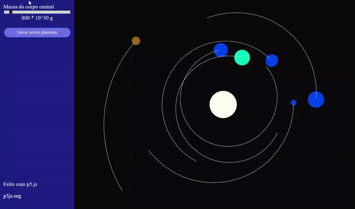

# "Simulação" de gravidade
Fiz vendo esse vídeo no youtube
```
https://www.youtube.com/watch?v=pgFnZyL8zEA
```
E adaptei algumas coisas

### Repositório de quem "roubei" o código (nada se cria, tudo se copia)
```
https://github.com/michaelruppe/art/tree/master/solar-system-p5
```


